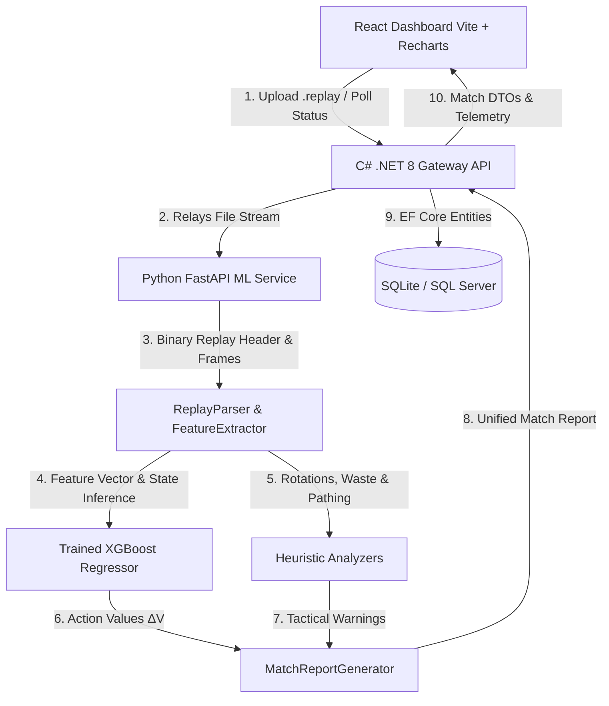

# 🚀 Rocket League Replay Analyzer — AI Telemetry & Impact Engine

A comprehensive full-stack analytics platform that ingests raw Rocket League `.replay` binary files, applies Machine Learning (XGBoost) to evaluate situational decision-making ($\Delta V$), extracts high-level positioning and boost heuristics, and serves interactive match insights through a modern dark-mode React dashboard.

---

## 🏗️ System Architecture



---

## 📦 Stack & Technologies

| Layer | Technologies |
|---|---|
| **Python ML Engine (`ml-service`)** | Python 3.10+, FastAPI, Uvicorn, XGBoost, Pandas, NumPy, Scikit-Learn, Pytest |
| **Backend Gateway API (`gateway-api`)** | C# .NET 8 Web API, Entity Framework Core, SQLite / SQL Server, Swagger / OpenAPI, xUnit |
| **Frontend Dashboard (`rl-analyzer-ui`)** | React 19, Vite, Recharts, Axios, Lucide React, Modern Glassmorphism CSS |

---

## 🚀 Quick Start

### 1. Launch All Services Concurrently (Windows)
Run the provided PowerShell startup script from the project root:
```powershell
.\start_all.ps1
```

### 2. Or Start Services Individually

#### **1. Python ML Service**
```powershell
cd ml-service
.venv\Scripts\uvicorn api.main_api:app --host 127.0.0.1 --port 8000 --reload
```
*API Documentation:* `http://127.0.0.1:8000/docs`

#### **2. C# .NET Gateway API**
```powershell
cd gateway-api
dotnet run --urls "http://127.0.0.1:5000"
```
*Swagger UI:* `http://127.0.0.1:5000/swagger`

#### **3. React UI Dashboard**
```powershell
cd rl-analyzer-ui
npm run dev
```
*Dashboard Web App:* `http://localhost:5173`

---

## 🧪 Testing

### Run Python Automated Tests
```powershell
cd ml-service
.venv\Scripts\pytest -v tests/test_ml_service.py
```

### Run .NET Automated Tests
```powershell
dotnet test gateway-api.Tests/gateway-api.Tests.csproj
```

### Run Frontend Production Build
```powershell
cd rl-analyzer-ui
npm run build
```

---

## 📊 Key Features

- **XGBoost Action Value ($\Delta V$) Evaluator**: Computes state probability shift $V_{after} - V_{before}$ across every single touch in the match to isolate high-impact clutch plays vs counter-attack risks.
- **3rd-Man Rotation Analyzer**: Flags *Creeping* (< 2500 uu as last defender) and *Sagging* (> 6000 uu) defensive blunders.
- **Supersonic Boost Waste Detector**: Identifies boost consumption when travelling at max speed ($\ge 22,000\text{ uu/s}$).
- **Small Pad Micro-Pathing**: Tracks pickup accuracy over midfield boost lines to measure boost routing discipline.
- **Match History Database**: Stores analyzed replays in relational database tables with one-click reload.
